# GHOSTRECON

**Framework de OSINT e reconhecimento** para **bug bounty** e pentest autorizado. Um servidor **Node.js + Express** orquestra recolha **passiva** (Certificate Transparency, arquivos web, DNS, cabeçalhos, TLS, APIs públicas), fases **semi-ativas** (HTTP, verificação com evidência) e, opcionalmente, **modo Kali** (nmap, nuclei, ffuf, wpscan, dalfox, sqlmap, xss_vibes, …). A UI (`index.html`) consome o pipeline em **NDJSON**; há ainda **Ghostmap**, **Cortex** e **Reporte** — três ecrãs para narrativa de ameaça, grafo por categorias e triagem humana.

```bash
npm install && npm start
# → http://127.0.0.1:3847
```

---

## Índice

- [O que tens neste repo](#o-que-tens-neste-repo)
- [Instalação](#instalação)
- [Interface e páginas estáticas](#interface-e-páginas-estáticas)
- [Pipeline (visão única)](#pipeline-visão-única)
- [Módulos e capacidades](#módulos-e-capacidades)
- [MITRE ATT&CK e OWASP](#mitre-attck-e-owasp)
- [Integrações pesadas (opcional)](#integrações-pesadas-opcional)
- [API HTTP e eventos NDJSON](#api-http-e-eventos-ndjson)
- [Persistência (SQLite / Postgres / Supabase)](#persistência-sqlite--postgres--supabase)
- [Segurança do servidor](#segurança-do-servidor)
- [Variáveis de ambiente](#variáveis-de-ambiente)
- [Docker](#docker)
- [Testes e scripts](#testes-e-scripts)
- [Estrutura do repositório](#estrutura-do-repositório)
- [Extensão e contribuição técnica](#extensão-e-contribuição-técnica)
- [Aviso legal](#aviso-legal)

---

## O que tens neste repo

| Área | Descrição |
|------|-----------|
| **Recon passivo → semi-ativo** | Subdomínios (crt.sh, VT, Subfinder/Amass em Kali), DNS rico (MX/TXT/DMARC), RDAP, probe HTTP, TLS, robots/sitemap, `.well-known`, Shodan, Wayback, Common Crawl, gau/waybackurls, Katana (perfil deep), OpenAPI/Swagger, GraphQL (introspecção mínima), superfície HTML, JS + secrets |
| **OSINT** | Google dorks (fila na UI) + **Google CSE** com API |
| **Código e leaks** | GitHub Code/Repo Search, clone local para `clone/`, validação de secrets |
| **Verificação** | `verify` (XSS/SQLi/open redirect/IDOR/LFI com evidência), `micro_exploit`, **webshell heurístico**, descoberta activa de parâmetros, **`sqlmap`** opcional, **Playwright** para XSS DOM opcional |
| **Kali** | nmap (incl. perfis agressivo/UDP opcionais), searchsploit, ffuf, nuclei, dalfox, wpscan, whois, **xss_vibes** (Python), **intel MySQL 3306** + correlação com ficheiros de config no score |
| **Inteligência** | Priorização v2, CVE hints (NVD/OSV), correlação, dedupe semântico, templates de relatório, checklist e sugestões, **snapshot de cobertura de recon** (`recon_coverage`) |
| **UI extra** | Ghostmap (MITRE/OWASP ao vivo), Cortex (categorias + SQLite), Reporte + anotações IA |
| **IA** | Relatórios Markdown (Gemini, OpenRouter, Claude, LM Studio em cascata) |
| **Integrações** | Shannon Lite (white-box), PentestGPT HTTP, webhooks (incl. Discord) |

---

## Instalação

### Requisitos

- **Node.js ≥ 18** (o `Dockerfile` usa Node 22).
- Para modo completo: **Debian/Kali** ou derivado com `apt` (recomendado para `./install.sh`).

### NPM

```bash
npm install
npm start          # produção
npm run dev        # node --watch
npm test           # node --test server/tests/*.test.js
```

### Instalador Debian/Kali (`install.sh`)

Script bash com perfis:

| Perfil | Conteúdo |
|--------|----------|
| `minimal` | APT base, Node 22, `npm install`, `.env` a partir de `.env.example` |
| `passive` | Minimal + ferramentas Go (subfinder, nuclei, katana, gau, waybackurls, dalfox), deps Python do **xss_vibes**, Supabase CLI (`.deb` GitHub) |
| `full` | Passive + exploitdb, amass, wpscan, Playwright/Chromium, clones opcionais **Shannon** + **PentestGPT** |

```bash
chmod +x install.sh
./install.sh --profile full        # ou minimal | passive
./install.sh --profile full --skip-ias --skip-docker
```

Opções: `--skip-ias`, `--skip-playwright`, `--skip-docker`, `--skip-supabase`.

---

## Interface e páginas estáticas

| Ficheiro | Função |
|----------|--------|
| [`index.html`](index.html) | Consola principal: domínio, perfil (`quick` / `standard` / `deep`), módulos, modo Kali, stream NDJSON, exportações, hub sidebar |
| [`mitre-map.html`](mitre-map.html) | **Ghostmap** — timeline MITRE/OWASP; `BroadcastChannel` + `localStorage` com a sessão principal |
| [`cortex.html`](cortex.html) | **Cortex** — categorias, links fingerprint ↔ categoria (`/api/brain/*`), grafo local; demo: `?demo=1` ou Shift+clique |
| [`reporte.html`](reporte.html) | **Reporte** — checklist manual, validações, IA sobre validados; payload via `sessionStorage` |
| [`anotacao.html`](anotacao.html) | Modelo de anotações (10 secções) com IA (OpenRouter) |
| [`como-usar.html`](como-usar.html) | Fluxo Reporte + anotações |
| [`brain.html`](brain.html) | Redireciona para `cortex.html` |

Guia rápido de fluxo humano: abre **[`como-usar.html`](como-usar.html)** no mesmo origin que o servidor.

**Nota:** abrir `index.html` via `file://` **não** executa o pipeline — é necessário `npm start` (ou proxy estático equivalente).

---

## Pipeline (visão única)

Orquestração em `server/index.js` (`runPipeline`). Ordem efectiva (simplificada):

```mermaid
flowchart LR
  A[Entrada + scope] --> B[Subs + DNS]
  B --> C[HTTP alive + tech]
  C --> D[Surface TLS/robots/well-known]
  D --> E[URLs arquivo + filtros]
  E --> F[Params + JS + dorks]
  F --> G[Secrets + validação]
  G --> H[Verify + micro-exploit]
  H --> I[Webshell probe opcional]
  I --> J[Param discovery activo]
  J --> K[SQLMap opcional]
  K --> L[Kali opcional]
  L --> M[Assets + takeover]
  M --> N[Score + CVE + dedupe + recheck + Playwright + recon_coverage]
  N --> O[Shannon opcional]
  O --> P[PentestGPT opcional]
  P --> Q[OWASP + MITRE tags]
  Q --> R[saveRun + delta_hot]
  R --> S[done + IA opcional + webhook]
```



Fases **`pipe`** expostas na UI incluem entre outras: `input`, `subdomains`, `dns_enrichment`, `rdap`, `alive`, `surface`, `urls`, `params`, `js`, `dorks`, `secrets`, `verify`, `webshell_probe`, `sqlmap`, `kali`, `assets`, `score`, `shannon`, `pentestgpt`.

---

## Módulos e capacidades

Os módulos seleccionáveis estão em [`index.html`](index.html) (checkboxes `class="mod"`). Resumo por família:

- **Scope:** `out_of_scope` — lista + wildcards (`*.cdn.cliente.com`); ver `server/modules/scope.js`.
- **Fontes / arquivo:** `subdomains`, `wayback`, `common_crawl`, `gau`, `waybackurls`, `rdap`, `virustotal`, `dns_enrichment`, `security_headers`, `header_intel`, `wafw00f`, `robots_sitemap`, `wellknown_security_txt`, `wellknown_openid`, `shodan`, `openapi_specs`, `graphql_probe`.
- **OSINT Google:** categorias de dork (`directory`, `config`, …) + `google_cse`.
- **Secrets / código:** `github`, `pastebin`, validação automática de secrets; clone GitHub (`GHOSTRECON_GITHUB_*`).
- **Prova:** `verify_sqli_deep`, `micro_exploit`, `webshell_probe`, **`sqlmap`** (limite de alvos via `GHOSTRECON_SQLMAP_TARGETS`), `stealth_requests` (ou `GHOSTRECON_STEALTH=1`).
- **Kali** (requer ambiente Kali ou `GHOSTRECON_FORCE_KALI=1` + ferramentas): `subfinder`, `amass`, `kali_ffuf`, `kali_nuclei`, **`kali_nmap_aggressive`**, **`kali_nmap_udp`**, **`mysql_3306_intel`**, wpscan, nuclei/dalfox/xss_vibes conforme sinais.
- **IA integrada:** `shannon_whitebox`, `pentestgpt_validate` — ver secção seguinte.

Após o **score**, o servidor pode correlacionar exposição MySQL em rede com ficheiros de config (`buildMysqlConfigSurfaceCorrelationFindings`), fazer **recheck HTTP** em achados HIGH (`runHighPrioHttpRecheck`), sondagem **Playwright** XSS (`GHOSTRECON_PLAYWRIGHT_*`), e emitir **`recon_coverage`** com resumo do que correu e do ambiente.

---

## MITRE ATT&CK e OWASP

- **`mitre-attack/recon-bundle.json`** — subconjunto Enterprise (reconnaissance, resource-development, initial-access). Regenerar: `npm run mitre:extract` (requer clone local de [MITRE CTI](https://github.com/mitre/cti) em `mitre-attack/cti/`, pasta pesada e ignorada no Git).
- **`server/modules/mitre-recon.js`** / **`owasp-top10.js`** — heurísticas por finding; etiquetas finais aplicadas **após** PentestGPT e **antes** de gravar o run.

---

## Integrações pesadas (opcional)

### Shannon Lite (white-box)

Código **não** está neste repo — clone em `IAs/shannon/` (ver [`IAs/README.md`](IAs/README.md)). O pipeline pode executar `./shannon start` sobre clones GitHub, ler relatórios em `.shannon/deliverables/`, espelhar CLI (`shannon_cli`), abrir Temporal Web UI (`open_url`). Configuração: `GHOSTRECON_SHANNON_*`.

### PentestGPT

Validação HTTP **POST** com `ghostPayload` — URL `GHOSTRECON_PENTESTGPT_URL` ou campo na UI. Ponte opcional: `npm run pentestgpt-bridge`. Árvore GreyDGL opcional em `IAs/PentestGPT/`.

### Relatórios IA

Cascata configurável (Gemini, OpenRouter, Claude, LM Studio). `GET /api/capabilities` expõe `ai`, `shannon`, `pentestgpt`.

### Webhook

`GHOSTRECON_WEBHOOK_URL` — resumo pós-run; segundo POST após IA com embeds Discord quando aplicável.

---

## API HTTP e eventos NDJSON

### Rotas principais

| Método | Rota | Descrição |
|--------|------|-----------|
| `GET` | `/`, `/mitre-map.html`, `/cortex.html`, `/reporte.html`, … | Ficheiros estáticos na raiz do projeto |
| `GET` | `/mitre-attack/recon-bundle.json` | Bundle MITRE |
| `GET` | `/api/health` | Healthcheck |
| `GET` | `/api/csrf-token` | Token CSRF (~2 h, por IP) |
| `GET` | `/api/capabilities` | Kali, PATH, chaves IA, Shannon, PentestGPT |
| `POST` | `/api/recon/stream` | **Corpo JSON do recon** — resposta **NDJSON** |
| `POST` | `/api/ai-reports` | Relatórios IA a partir de export JSON |
| `GET` | `/api/runs`, `/api/runs/:id`, `/api/runs/:newerId/diff/:baselineId` | Histórico e diff |
| `GET` | `/api/intel/:target` | Corpus deduplicado |
| `GET`/`POST` | `/api/brain/*` | Cortex — categorias e links |
| `GET`/`POST` | `/api/manual-validations*` | Reporte + `ai-report` opcional |
| `POST` | `/api/shannon/prep`, `/api/pentestgpt-ping` | Prep Docker Shannon, health PentestGPT |
| `GET` | `/api/ai/lmstudio-check` | Pré-check LM Studio |

Cabeçalho obrigatório nos POST sensíveis: **`X-CSRF-Token`**. Corpo máx. **5 MB** em `/api/recon/stream`.

### Eventos NDJSON (tipos)

Além de `log`, `progress`, `pipe`, `stats`, `finding`, `dork`, `open_url`, `intel`, `report_template`, `priority_pass`, `findings_rescore`, `delta_hot`, `ai_report`, `done`, `error`:

- **`shannon_cli`** — linhas do Shannon (ANSI removido).
- **`recon_coverage`** — snapshot de cobertura do run (módulos, Kali, achados).

Exemplo mínimo de corpo para `POST /api/recon/stream`:

```json
{
  "domain": "example.com",
  "exactMatch": false,
  "kaliMode": false,
  "profile": "standard",
  "modules": ["subdomains", "wayback", "security_headers", "github"],
  "outOfScope": "staging.example.com",
  "projectName": "cliente_x",
  "autoAiReports": false,
  "aiProviderMode": "auto"
}
```

---

## Persistência (SQLite / Postgres / Supabase)

- **SQLite local:** default `data/bugbounty.db` (override `GHOSTRECON_DB`).
- **Postgres:** `DATABASE_URL` (pooler Supabase IPv4, etc.).
- **Supabase API:** `SUPABASE_URL` + chave (`SUPABASE_ANON_KEY`, `SUPABASE_SERVICE_ROLE_KEY`, …).
- Migrações: `supabase/migrations/`; atalho SQL: `supabase/COPIAR_PARA_SQL_EDITOR.sql`.
- Com **nome de projeto** na UI: espelho opcional em `escopo/{projeto}/{domínio}/`.

Comandos npm: `npm run db:link`, `npm run db:push`, `npm run db:migration:new`.

---

## Segurança do servidor

- **CORS** restrito a `http://127.0.0.1:PORT` e `http://localhost:PORT`.
- **CSRF** em todos os POST mutáveis listados acima.
- **Rate limit** opcional: `GHOSTRECON_RL_MAX` / `GHOSTRECON_RL_WINDOW_MS`.

---

## Variáveis de ambiente

Lista completa e comentários: **[`.env.example`](.env.example)**. Inclui: APIs (VT, Shodan, GitHub, Google CSE), base de dados, Shannon, PentestGPT, IA, webhook, Kali, wpscan, xss_vibes, Playwright, stealth, scope global, Common Crawl CDX, limites de relatório IA.

---

## Docker

```bash
docker build -t ghostrecon .
docker run --rm -p 3847:3847 --env-file .env ghostrecon
```

A imagem **oficial** copia apenas `server/` e `index.html` — é adequada a um **modo mínimo**. Para **Ghostmap / Cortex / Reporte** e restantes `.html`, monta a raiz do repo ou amplia o `Dockerfile` (por exemplo `COPY *.html ./`).

Não inclui ferramentas Kali dentro da imagem.

---

## Testes e scripts

| Comando | Função |
|---------|--------|
| `npm test` | Suite `server/tests/*.test.js` |
| `npm run mitre:extract` | Regenera `mitre-attack/recon-bundle.json` |
| `npm run pentestgpt-bridge` | Ponte OpenRouter → endpoint de validação |
| `npm run test:ai` | Smoke das APIs de IA |

---

## Estrutura do repositório

```
GHOSTRECON/
├── index.html, mitre-map.html, cortex.html, reporte.html, …
├── package.json
├── install.sh
├── Dockerfile
├── .env.example
├── mitre-attack/recon-bundle.json
├── mitre-attack/cti/          # clone MITRE/cti (opcional, não versionado)
├── IAs/README.md            # Shannon + PentestGPT (clones em IAs/, ignorados)
├── Xss/xss_vibes/           # Scanner XSS auxiliar (Python)
├── clone/                   # clones git em runtime (ignorado)
├── supabase/                # config, migrations, SQL editor
└── server/
    ├── index.js             # Express + pipeline
    ├── config.js            # Limites globais
    ├── load-env.js
    ├── scripts/             # mitre extract, pentestgpt bridge, smoke IA
    ├── modules/             # dezenas de módulos (recon, DB, IA, Kali, …)
    └── tests/
```

---

## Extensão e contribuição técnica

- Novos dorks: `server/modules/dorks.js` + checkbox em `index.html` com `class="mod"` e o mesmo `value`.
- Nova fonte: módulo em `server/modules/`, integração em `runPipeline` com eventos `pipe` / `log` consistentes.
- Limites: `server/config.js`.

---

## Aviso legal

Usa **apenas** contra alvos **autorizados**. Mesmo o modo passivo gera tráfego HTTP e consultas a terceiros (crt.sh, Archive.org, APIs Google/GitHub, …). O **modo Kali** e ferramentas como **sqlmap**, **nuclei**, **Shannon** e **PentestGPT** podem ser **intrusivos**. Cumpre os termos dos programas de bug bounty e a legislação aplicável.
