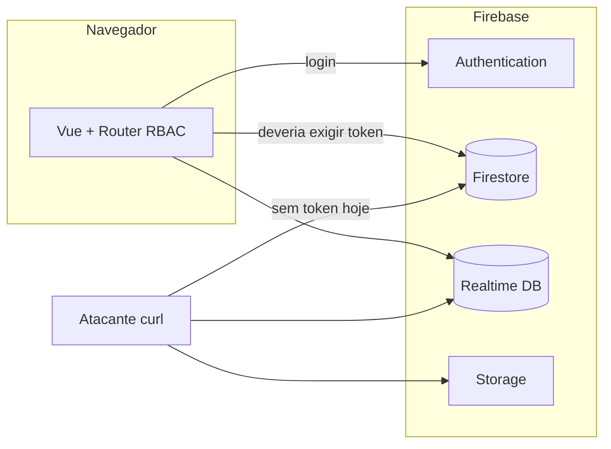

# Relatório de segurança — Painel Admin PhotoNow

**Alvo:** https://admin.photonow.com.br/login  
**Data da análise:** 22/05/2026  
**Tipo:** Revisão passiva (black-box) + validação de backend Firebase  
**Escopo:** Frontend (S3/CloudFront) e serviços Firebase (`photonow-app`)

**PoCs (reprodução):** [POC-PHOTONOW-ADMIN.md](./POC-PHOTONOW-ADMIN.md) · Scripts: `poc-firebase-photonow.sh`, `poc-criar-admin.sh`

---

## Sumário executivo

O painel admin é uma SPA Vue hospedada em S3/CloudFront. A autenticação usa Firebase Auth (e-mail/senha), mas **a autorização real não está implementada no backend**: Firestore, Realtime Database e Storage aceitam operações **sem login**.

| Severidade | Quantidade | Resumo |
|------------|------------|--------|
| **Crítica** | 5 | Leitura/escrita anônima em RTDB e Firestore; possível criação de perfil ADMIN; dados de usuários e totens expostos |
| **Alta** | 1 | Listagem pública no Firebase Storage |
| **Média** | 2 | Controle de papéis só no frontend; source maps em produção |
| **Informativa** | 2 | apiKey pública (esperado em SPA); RTDB de homologação também exposto |

**Recomendação imediata:** corrigir Security Rules no Firebase antes de qualquer outro hardening. Tratar como possível incidente até validação pós-correção (ver PoCs no documento dedicado).

**O que não foi feito na auditoria:** não houve login no painel, não foram obtidas credenciais de usuários reais e não foi criada conta admin persistente em produção.

---

## 1. Objetivo

Registrar **achados de segurança**, **impacto**, **metodologia de descoberta** e **plano de correção** do painel administrativo PhotoNow.

A reprodução técnica (comandos, scripts, template de evidência) está em **[POC-PHOTONOW-ADMIN.md](./POC-PHOTONOW-ADMIN.md)**.

---

## 2. Metodologia

Análise em camadas, **sem credenciais**:

```
Recon HTTP → Bundles JS → Mapeamento auth/RBAC → Teste APIs Firebase anônimas → Consolidação
```

### 2.1 Reconhecimento do site

| Item | Resultado |
|------|-----------|
| Hosting | Amazon S3 + CloudFront |
| Aplicação | SPA Vue (`photo-now gestao`) |
| Headers de segurança | Ausentes (HSTS, CSP, X-Frame-Options, etc.) |
| Source map | `app.*.js.map` acessível (HTTP 200) |

### 2.2 Análise do frontend

Extraído dos bundles `app.*.js` e `chunk-login`:

| Tópico | Descoberta |
|--------|------------|
| Backend | Firebase (`photonow-app`) |
| Login | `signInWithEmailAndPassword` → leitura `users/{uid}` no Firestore |
| Papéis | `ADMIN`, `TECNICO`, `FRANQUEADO`, `FINANCEIRO` |
| RBAC | `router/permissions` — **somente no cliente** |
| Coleções citadas | `users`, `totem`, `userFranqueado` (+ outras nas rotas) |
| Ambiente dev | Projeto `cabine-teste` para `localhost` / `admin-photonow.web.app` |

A **apiKey** Firebase no JS é comportamento normal de SPA; o risco está nas **rules abertas**, não na chave em si.

### 2.3 Validação do backend

Chamadas REST às APIs Firebase **sem** header `Authorization`, usando apenas a apiKey pública do bundle. Detalhes e comandos: [POC-PHOTONOW-ADMIN.md](./POC-PHOTONOW-ADMIN.md).

---

## 3. Achados

### 3.1 [CRÍTICO] Realtime Database — leitura pública

- **CWE:** CWE-306  
- **Descrição:** O nó raiz e filhos do RTDB `photonow-app-default-rtdb` são legíveis sem autenticação.  
- **Impacto:** Exposição de status operacional dos totens (nome, estado, impressora, pagamento, caminhos de sistema, etc.).  
- **PoC:** [PoC-1](./POC-PHOTONOW-ADMIN.md#1-poc-1--rtdb-leitura-anônima)

### 3.2 [CRÍTICO] Realtime Database — escrita pública

- **CWE:** CWE-306  
- **Descrição:** Escrita e exclusão anônimas em nós arbitrários (validado em `_poc_seguranca`).  
- **Impacto:** Sabotagem ou falsificação de telemetria em tempo real.  
- **PoC:** [PoC-2](./POC-PHOTONOW-ADMIN.md#2-poc-2--rtdb-escrita-anônima)

### 3.3 [CRÍTICO] Firestore — leitura pública (incl. `users`)

- **CWE:** CWE-200, CWE-306  
- **Descrição:** Coleção `users` e outras legíveis via REST sem token.  
- **Impacto:** Vazamento de e-mails, nomes, papéis (`ADMIN`, etc.) e metadados de franqueados.  
- **PoC:** [PoC-3](./POC-PHOTONOW-ADMIN.md#3-poc-3--firestore-users-leitura-anônima), [PoC-5](./POC-PHOTONOW-ADMIN.md#5-poc-5--firestore-outras-coleções-leitura)

### 3.4 [CRÍTICO] Firestore — escrita pública

- **CWE:** CWE-306  
- **Descrição:** Criação/alteração de documentos sem `request.auth`.  
- **Impacto:** Manipulação de totens, compras, cupons; possível injeção de perfil em `users/{uid}`.  
- **PoC:** [PoC-4](./POC-PHOTONOW-ADMIN.md#4-poc-4--firestore-escrita-anônima)

### 3.5 [CRÍTICO] Escalação — usuário ADMIN (Auth + Firestore)

- **CWE:** CWE-269, CWE-306  
- **Descrição:** Se cadastro Auth estiver habilitado (ou usuário criado no Console), um atacante pode gravar `users/{uid}` com `role: ADMIN` sem autenticação nas rules.  
- **Impacto:** Login completo no painel com privilégios de administrador.  
- **PoC:** [PoC-7](./POC-PHOTONOW-ADMIN.md#7-poc-7--criar-usuário-com-perfil-admin) · script `poc-criar-admin.sh`

### 3.6 [ALTO] Firebase Storage — listagem pública

- **CWE:** CWE-200  
- **Descrição:** Bucket `photonow-app.appspot.com` listável sem login.  
- **Impacto:** Exposição de arquivos (ex.: logs de erro por totem).  
- **PoC:** [PoC-6](./POC-PHOTONOW-ADMIN.md#6-poc-6--storage-listagem-pública)

### 3.7 [MÉDIO] Autorização apenas no frontend

- **CWE:** CWE-602  
- **Descrição:** Vue Router bloqueia rotas por papel; APIs Firebase não aplicam o mesmo controle.  
- **Impacto:** Bypass total via chamadas diretas à API.  
- **PoC:** [PoC-8](./POC-PHOTONOW-ADMIN.md#8-poc-8--rbac-só-no-frontend)

### 3.8 [MÉDIO] Source maps em produção

- **CWE:** CWE-200  
- **Descrição:** `app.*.js.map` expõe árvore `src/` (`firebase.js`, `permissions.js`, stores).  
- **Impacto:** Facilita engenharia reversa e ataques direcionados.  
- **PoC:** [PoC-9](./POC-PHOTONOW-ADMIN.md#9-poc-9--source-maps-em-produção)

### 3.9 [INFO] RTDB de homologação exposto

- **Descrição:** Projeto `cabine-teste` com o mesmo padrão de leitura pública.  
- **PoC:** [PoC-10](./POC-PHOTONOW-ADMIN.md#10-poc-10--rtdb-homologação)

### 3.10 [INFO] Cadastro Auth via API REST

- Teste de `signUp` sem `Referer` retornou bloqueio de referrer na apiKey — mitigação parcial. Cadastro ainda pode ser possível com headers do admin ou pelo Console; não elimina o risco das rules abertas no Firestore.

---

## 4. Matriz de exposição (auditoria 22/05/2026)

| Recurso | Leitura anônima | Escrita anônima | PoC |
|---------|-----------------|-----------------|-----|
| RTDB produção | Sim | Sim | PoC-1, PoC-2 |
| Firestore `users` | Sim | Sim (testado) | PoC-3, PoC-4, PoC-7 |
| Firestore `totem`, `compras`, etc. | Sim | Não testado em profundidade | PoC-5 |
| Storage | Listagem sim | Não testado | PoC-6 |
| Painel (login) | N/A | N/A | Não explorado com credenciais |

---

## 5. Arquitetura de confiança (problema raiz)



Hoje o atacante **ignora** o router Vue e fala direto com Firestore/RTDB/Storage.

---

## 6. Plano de correção

### 6.1 Prioridade 0 (imediato)

1. **Firestore Rules** — `request.auth != null`; validar `role` em `users/{request.auth.uid}` para cada coleção.  
2. **RTDB Rules** — negar `.read` / `.write` quando `auth == null`.  
3. **Storage Rules** — exigir `request.auth != null`.  
4. Executar [validação pós-correção](./POC-PHOTONOW-ADMIN.md#11-validação-após-correção).

### 6.2 Prioridade 1 (curto prazo)

- Remover `*.js.map` do deploy de produção.  
- Headers no CloudFront: HSTS, CSP, `X-Content-Type-Options`, `frame-ancestors`.  
- Restringir apiKey por HTTP referrer (`admin.photonow.com.br`).  
- Desabilitar cadastro público em Auth se não for necessário.  
- Auditar logs Firebase / contas admin; rotacionar senhas se houver suspeita de abuso.

### 6.3 Exemplo mínimo — Firestore Rules

```javascript
rules_version = '2';
service cloud.firestore {
  match /databases/{database}/documents {
    function isSignedIn() {
      return request.auth != null;
    }
    function userDoc() {
      return get(/databases/$(database)/documents/users/$(request.auth.uid));
    }
    function hasRole(role) {
      return isSignedIn() && role in userDoc().data.role;
    }

    match /users/{userId} {
      allow read: if isSignedIn() && (request.auth.uid == userId || hasRole('ADMIN'));
      allow write: if hasRole('ADMIN');
    }

    match /totem/{id} {
      allow read: if isSignedIn() && (hasRole('ADMIN') || hasRole('TECNICO') || hasRole('FRANQUEADO'));
      allow write: if hasRole('ADMIN') || hasRole('TECNICO');
    }
    // Estender para compras, cupons, userFranqueado, molduras, logs...
  }
}
```

Ajustar cada `match` ao modelo real de permissões do negócio.

### 6.4 RTDB Rules (esboço)

```json
{
  "rules": {
    ".read": "auth != null",
    ".write": "auth != null"
  }
}
```

Refinar por subárvore conforme necessidade dos totens.

---

## 7. Referências

- [Firebase Security Rules](https://firebase.google.com/docs/rules)
- [OWASP — Broken Access Control](https://owasp.org/Top10/A01_2021-Broken_Access_Control/)
- PoCs internos: [POC-PHOTONOW-ADMIN.md](./POC-PHOTONOW-ADMIN.md)

---

## 8. Histórico

| Versão | Data | Notas |
|--------|------|-------|
| 1.0 | 22/05/2026 | Relatório inicial |
| 1.1 | 22/05/2026 | PoC criar usuário ADMIN |
| 2.0 | 22/05/2026 | PoCs movidos para `POC-PHOTONOW-ADMIN.md`; relatório focado em achados |

---

*Auditoria interna PhotoNow. Confidencial.*
